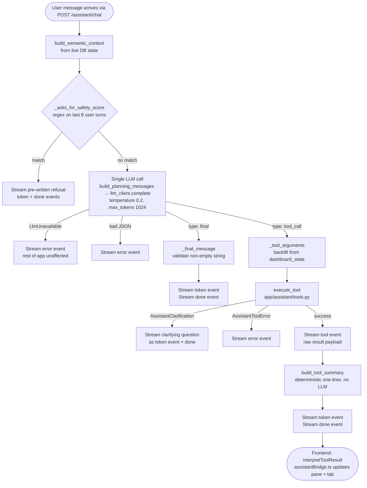

Reference for the Waypoint Analyst — the optional chat assistant that is grounded in the user's current dashboard data and answers questions about reported SPD incident context.

> Verified against `d30235b` (2026-06-29).

---

## 1. Decision-tree architecture

Every user turn follows a fixed three-phase path. There is exactly **one** LLM call per turn (a *classify-and-plan* call), and the assistant response is produced deterministically from the plan output without a second narration call.

**Phase 1 — safety-refusal gate (no LLM)**

Before the LLM is consulted, `run_assistant_turn` in `app/assistant/agent.py` scans the last eight user messages with `_asks_for_safety_score`. If the regex `_SAFETY_SCORE_PATTERN` matches, the turn is short-circuited: a pre-written refusal is streamed as `token` events and a `done` event is emitted. The LLM is never contacted.

**Phase 2 — single classify-only LLM call**

`build_planning_messages` (`app/assistant/prompts.py`) assembles a system prompt, a `SemanticContextPacket` payload (the user's dashboard state, saved-place metadata, active filters, available tools, and policy caveats), and up to the last eight conversation turns. The LLM is instructed to respond with exactly one JSON object in one of two shapes:

```
{"type": "final",    "message": "..."}
{"type": "tool_call","tool_name": "...","arguments": {...}}
```

No prose, no markdown fences. This is a *planning* call, not a narration call. The response is parsed by `_parse_model_json` (which tolerates code-fence wrapping and uses a brace-depth extractor as a last resort).

**Phase 3 — deterministic per-node summary (no LLM)**

- **`type: final`** — `_final_message` validates that `message` is a non-empty string and streams it directly.
- **`type: tool_call`** — `execute_tool` dispatches to the appropriate handler in `app/assistant/tools.py`, then `build_tool_summary` (`app/assistant/summaries.py`) produces a neutral, deterministic one-liner from the result fields. No second LLM call.

**Clarification branch**

When a tool handler cannot proceed without more information (e.g., no places are resolvable), it raises `AssistantClarification`. The agent catches this separately from `AssistantToolError`, streams the exception message as a `token` event (so the user sees a polite question, not an error), and returns `done`.

**Why this architecture?**

A single planning call eliminates the failure mode where a post-tool narration call hangs or times out when the LLM is slow but reachable. Because the summary is deterministic, latency is bounded by the one planning call plus the tool's database query — not by a second model generation. It also makes the refusal guarantee reliable: the safety-score gate runs before any LLM contact, so a model cannot be prompted around it.

---

## 2. Toolbox

The six tools advertised to the LLM via `AVAILABLE_TOOLS` in `app/assistant/semantic_layer.py` are:

| Tool name | Purpose |
|---|---|
| `add_place` | Geocode a single place query and save it to the user's saved places |
| `select_places` | Resolve one or more place names to saved places (creating missing ones) and set the dashboard selection; supports `replace`, `add`, `clear` modes |
| `analyze_places` | Resolve names (or use the current selection), run the reported-incident analysis, and return neighborhood-vs-beat verdicts plus incident details |
| `compare_places` | Resolve two or more names (or use the selection), run the analysis, and return a side-by-side comparison |
| `get_dashboard_summary` | Read current dashboard totals and the list of saved places (read-only) |
| `suggest_followups` | Return a fixed list of deterministic follow-up suggestions |

Three additional tool branches exist in `execute_tool` (`run_place_analysis`, `get_neighborhood_analysis`, `get_incident_details`) but are **not** included in `AVAILABLE_TOOLS` — they are retained for non-agent paths and existing tests. The LLM is never told about them; `analyze_places` subsumes them for the agent.

**Tool-call cap**

The single-planning-call architecture executes at most one tool per turn, so there is no separately-configurable per-turn cap. (The earlier `MCA_ASSISTANT_MAX_TOOL_CALLS` setting was removed once the multi-tool loop went away.)

**Argument backfill**

Small local models frequently emit a `tool_call` with empty or partial `arguments`. `_tool_arguments` in `app/assistant/agent.py` backfills the dashboard state (selected place IDs, date range, radii, offense filters) for the five *selection tools* (`run_place_analysis`, `compare_places`, `get_neighborhood_analysis`, `get_incident_details`, `analyze_places`). Model-provided values override the backfilled defaults.

**Incident cap**

`get_incident_details` and the `analyze_places` handler both cap incident rows at `AGENT_INCIDENT_LIMIT = 100` (defined in `app/assistant/tools.py`).

---

## 3. Agent-driven pane analysis

The agent influences the right-hand dashboard pane by emitting `tool` SSE events. The frontend translates these events into concrete UI state changes via `interpretToolResult` in `frontend/src/lib/assistantBridge.ts`.

`interpretToolResult` receives the raw `{tool_name, result}` payload from a `tool` event and returns an `AssistantToolEffect` object (or `null` for read-only or unknown tools). The mapping is:

- **`analyze_places`** → switches to the `"analyze"` tab, replaces the selection with the resolved place IDs, updates analysis settings (radius, date range, offense category), writes `neighborhood` and `incidents` data into the pane, and sets `refetchSummary: true`.
- **`compare_places`** → switches to the `"compare"` tab, replaces the selection, updates settings, writes `comparison` data, and sets `refetchSummary: true`.
- **`add_place`** → appends the new place ID to the selection (`mode: "add"`) and sets `refetchSummary: true`.
- **`select_places`** → updates the selection with the mode returned by the tool (`replace`, `add`, or `clear`).
- **`get_dashboard_summary`, `suggest_followups`, and unknown tools** → return `null` (no pane change).

`AssistantPanel.tsx` and `MapWorkspace.tsx` consume the `AssistantToolEffect` to apply these state updates.

---

## 4. Semantic layer and deterministic summaries

**`app/assistant/semantic_layer.py`**

`build_semantic_context` assembles a `SemanticContextPacket` from live database state before the planning call. It includes: dashboard totals (saved place count, available radii), metadata for the currently selected places (label, coordinates, visit statistics, sensitivity class), the most recent `PlaceCrimeSummary` rows for those places, the user's active filters, the `AVAILABLE_TOOLS` list, and `POLICY_CAVEATS` (four invariant statements injected directly into the model's context, e.g. "Do not label places as safe or unsafe."). A `missing_context` list flags gaps (no saved places, no selection, no date range, no radius) that the model is expected to mention or work around.

**`app/assistant/summaries.py`**

`build_tool_summary` maps a tool result to a neutral one-liner entirely from result fields — no LLM. For `analyze_places` it reads `neighborhood.places` entries and formats rate-ratio phrases via `_DECISION_PHRASES` (e.g. `"above its beat baseline, statistically clear"`). For `compare_places` it lists per-place incident counts and the `overview.summary_text`. All handlers avoid safety/danger/risk language by design.

**`app/assistant/place_resolution.py`**

`resolve_place_queries` resolves free-text place names to database IDs. It first checks the user's saved places by normalized label (case-insensitive, whitespace-collapsed). On a miss it calls the geocoder, takes the top hit, and creates a new `PlaceCluster` via `create_manual_place`. Geocoder errors and no-hits leave the query in `unresolved` (not a hard error). The `_tool_arguments` backfill in `agent.py` calls this path when the model supplies `queries`.

---

## 5. LLM client

`app/assistant/llm_client.py` provides three classes:

- **`AssistantLlmClient`** — a `Protocol` defining the `complete` interface.
- **`OpenAiLlmClient`** — an OpenAI-compatible HTTP client. Posts to `{base_url}/chat/completions` with a 5-second connect timeout and a 120-second read timeout (the short connect timeout allows fast failover when an endpoint is offline; the long read timeout accommodates model load and generation latency once connected). Accepts an optional `extra_body` for llama.cpp options such as `{"chat_template_kwargs": {"enable_thinking": False}}` to suppress chain-of-thought on thinking models.
- **`FailoverLlmClient`** — wraps a list of `OpenAiLlmClient` instances and tries each in order per `complete` call. Falls back to the next client on `LlmUnavailable`. Raises `LlmUnavailable` only when every client fails.

**Configuration (all in `app/config.py`, env prefix `MCA_`)**

| Env var | Default | Purpose |
|---|---|---|
| `MCA_LLM_BASE_URL` | `http://127.0.0.1:8080/v1` | Primary endpoint (OpenAI-compatible) |
| `MCA_LLM_MODEL` | `gemma-4-26b-a4b-it-ud-q4-k-m-ctx32k` | Model name sent in each request |
| `MCA_LLM_DISABLE_THINKING` | `false` | Suppress chain-of-thought on thinking models |
| `MCA_LLM_FALLBACK_BASE_URL` | `""` | Second endpoint; failover activates only when this and `MCA_LLM_FALLBACK_MODEL` are both set |
| `MCA_LLM_FALLBACK_MODEL` | `""` | Model for the fallback endpoint |
| `MCA_LLM_FALLBACK_DISABLE_THINKING` | `false` | Suppress thinking on the fallback model |

The SSE endpoint in `app/api/routes_assistant.py` builds the client via `build_assistant_llm_client` on each request.

> ⚠ Invariant: when the LLM endpoint is offline or returns no content, `LlmUnavailable` is raised, the agent emits an `error` SSE event with a user-readable message, and returns. The rest of the Waypoint app (dashboard, places, exports, routes) is unaffected.

---

## 6. Refusal / policy invariant

> ⚠ Invariant: the Analyst refuses to score, rank, or label places by safety, danger, or risk. This refusal is enforced in `app/assistant/agent.py` and is a core product invariant (see also `CLAUDE.md`).

**Mechanism**

`_SAFETY_SCORE_PATTERN` is a compiled regex in `app/assistant/agent.py`:

```python
_SAFETY_SCORE_PATTERN = re.compile(
    r"\b(?:safe(?:ty|st|r)?|unsafe|danger(?:ous)?|risk(?:y|ier|iest)?)\b"
    r"|\b(?:rank|rate|score)\b\s+(?:these|those|them|the\s+)?"
    r"(?:place|block|area|neighbou?rhood|route|street|spot|option|location)s?\b",
    re.IGNORECASE,
)
```

`_asks_for_safety_score` searches this pattern against the last eight user messages (matching the window sent to the model). If any message matches, the turn is short-circuited before the LLM is called: a pre-written redirect is streamed telling the user to reframe the request as reported-incident counts or exposure-adjusted rates.

A second, softer layer appears in the system prompt (`PLANNING_SYSTEM_PROMPT` in `app/assistant/prompts.py`): explicit instructions to the model not to use safety/danger/risk language and to redirect to neutral framings.

**Known limitation**

The pre-LLM guard matches keywords with word-boundary anchors, which prevents false triggers on substrings like "safely" or "Safeway". However, it can be bypassed by paraphrasing (e.g., "which location would you feel more comfortable visiting?") or by requests that omit the flagged vocabulary. The guard is breadth-limited by its lexicon; it is not a semantic classifier. The system prompt provides a second line of defence, but a sufficiently unusual paraphrase could reach the model without triggering either layer.

**Verified gap (as of `d30235b`):** the optional noun-determiner clause `(?:these|those|them|the\s+)?` attaches the trailing `\s+` only to `the`, so object-first requests like *"rank these places"* or *"score these areas"* slip past the pre-LLM guard (only *"rank the places"* is caught). One-line fix, tracked as the top Phase 1 item in [`../ROADMAP.md`](../ROADMAP.md).

---

## 7. Per-turn request flow


