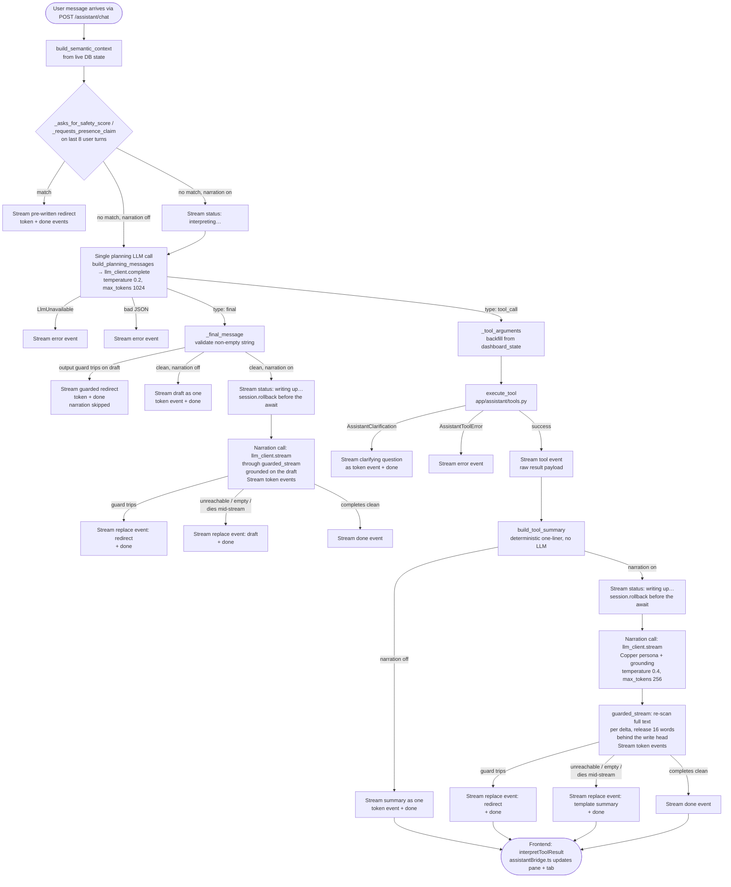

Reference for the Waypoint Analyst — the optional chat assistant that is grounded in the user's current dashboard data and answers questions about reported SPD incident context.

> Verified against `5641377` (2026-07-12).

## Persona — "Copper, case desk"

The Analyst presents as **Copper**, a fictional basset-hound detective at the case desk
(spec: `docs/superpowers/specs/2026-07-10-analyst-copper-persona-design.md`). The persona is
chrome + framing copy only: the `CopperAvatar` mark/bust SVGs and greeting/status/offline
strings in `AssistantPanel.tsx`, the in-voice `_SAFETY_REDIRECT`, the streamed narration's
system prompt (`NARRATION_SYSTEM_PROMPT` in `app/assistant/prompts.py` — "a dry, methodical
records hound"), and a layer-aware lead-in on `analyze_places`/`compare_places` summaries
("From the reports: ", "From the arrest records: ", or "From the call logs: " — see §5). Data
content, the guards, and the planning prompt carry no persona. Copper wears no SPD insignia and
never claims official status; "analyst" remains the product term (and the dock's aria-label).

---

## 1. Decision-tree architecture

Every user turn follows a fixed three-phase path. There is exactly **one** *planning* LLM call
per turn (a *classify-and-plan* call), and a deterministic summary or answer is always produced
from its output without waiting on any further model generation. When narration is enabled
(the default — see §2 for the full turn/event picture), that deterministic text is then handed
to a second, **streamed** narration call that writes the user-facing reply in Copper's voice;
every failure mode of that second call degrades back to the deterministic text, so the
single-planning-call reliability story below still holds end to end.

**Phase 1 — safety-refusal gate (no LLM)**

Before the LLM is consulted, `run_assistant_turn` in `app/assistant/agent.py` scans the last eight user messages with `_asks_for_safety_score`. If the regex `_SAFETY_SCORE_PATTERN` matches, the turn is short-circuited: a pre-written refusal is streamed as `token` events and a `done` event is emitted. The LLM is never contacted.

**Phase 2 — single classify-only LLM call**

`build_planning_messages` (`app/assistant/prompts.py`) assembles a system prompt, a `SemanticContextPacket` payload (the user's dashboard state, saved-place metadata, active filters, available tools, and policy caveats), and up to the last eight conversation turns. The LLM is instructed to respond with exactly one JSON object in one of two shapes:

```
{"type": "final",    "message": "..."}
{"type": "tool_call","tool_name": "...","arguments": {...}}
```

No prose, no markdown fences. This is a *planning* call, not a narration call. The response is parsed by `_parse_model_json` (which tolerates code-fence wrapping and uses a brace-depth extractor as a last resort).

**Phase 3 — deterministic per-node summary (no LLM), then optional narration**

- **`type: final`** — `_final_message` validates that `message` is a non-empty string. The
  output-side guard (§7) re-checks this draft; a draft that violates it is streamed as the
  guarded redirect and narration is skipped entirely — a violating draft is never handed to the
  narrator. A clean draft becomes the grounding for the narration call (§2), and is also its
  fallback text if narration fails.
- **`type: tool_call`** — `execute_tool` dispatches to the appropriate handler in
  `app/assistant/tools.py`, the raw result streams as a `tool` event, then `build_tool_summary`
  (`app/assistant/summaries.py`) produces a neutral, deterministic one-liner from the result
  fields. That summary is the "authoritative" line in the narration call's grounding (§2) and
  the fallback text if narration fails.

When narration is disabled (`MCA_ASSISTANT_NARRATION_ENABLED=false`, §2), neither branch makes a
second LLM call — the deterministic text streams directly as a single `token` event, exactly as
before this slice shipped.

**Clarification branch**

When a tool handler cannot proceed without more information (e.g., no places are resolvable), it raises `AssistantClarification`. The agent catches this separately from `AssistantToolError`, streams the exception message as a `token` event (so the user sees a polite question, not an error), and returns `done`.

**Why this architecture?**

A single planning call eliminates the failure mode where a post-tool narration call hangs or
times out and leaves the user with nothing: the deterministic summary/draft is always computed
*before* narration is attempted, so a complete, correct answer exists as plain text the instant
the planning call and the tool's database query finish — not gated on a second model generation.
The streamed narration call (§2) only adds visible, incremental latency on top of an answer that
already exists; every way it can fail resolves back to that pre-computed text. It also makes the
refusal guarantee reliable: the safety-score gate runs before any LLM contact, so a model cannot
be prompted around it, and the same output-side guard that checks the deterministic draft also
polices the narrated stream token-by-token (§2).

---

## 2. Streaming: status events, narration, and the holdback guard

`/assistant/chat` is a Server-Sent Events stream. Every turn emits some subsequence of seven
event types (`AssistantStreamEvent`, `app/assistant/schemas.py`):

| Event | Payload | When |
|---|---|---|
| `meta` | `{role, missing_context}` | Once, first, before any guard or LLM contact |
| `status` | `{label}` | Zero or more times: `"interpreting your request…"` before the planning call, `"running <tool>…"` before tool execution, `"writing up…"` before the narration call |
| `tool` | raw `{tool_name, arguments, result}` | Once, on a successful `tool_call` plan, before the summary/narration |
| `token` | `{delta}` | Many times — small narration deltas, or once with the full deterministic text when narration is off/skipped |
| `replace` | `{text}` | At most once — wholesale replacement of everything streamed so far as `token` deltas for this turn (guard trip or narration failure) |
| `done` | `{}` | Once, always last on a turn that didn't error |
| `error` | `{message}` | Once, on a hard failure (LLM unreachable during planning, bad plan JSON, tool error, or an uncaught exception caught by the route handler) |

**Turn flow.** `run_assistant_turn` (`app/assistant/agent.py`) always emits `meta` first. The
input guards (safety-score ask, presence-claim ask — §7) short-circuit before any `status`
event: a refusal streams straight to `token` + `done`. Otherwise, when
`assistant_narration_enabled` is true, a `status(interpreting your request…)` event precedes the
single planning call. From there the plan branches exactly as in §1: a `tool_call` plan emits
`status(running <tool>…)` before `execute_tool`, then the raw result as a `tool` event, then the
deterministic `build_tool_summary` one-liner; a `final` plan validates and output-guards the
model's draft directly. In both branches, once the deterministic text is ready and narration is
enabled and the text passed the output guard, a `status(writing up…)` event precedes the
narration call.

**The narration call.** A second, streamed LLM call (`llm_client.stream` —
`OpenAiLlmClient.stream` or, with a configured fallback endpoint, `FailoverLlmClient.stream`)
writes the user-facing reply in Copper's voice (`NARRATION_SYSTEM_PROMPT`,
`app/assistant/prompts.py`). It is grounded on the deterministic text, never free-floating: for a
`tool_call` turn the grounding is the tool-result JSON (trimmed to
`MAX_GROUNDING_RESULT_CHARS = 4000` characters) plus the template summary framed as
`"Verified one-line summary (authoritative): ..."`; for a `final` turn the grounding is the
guard-checked draft itself, framed as `"Draft answer (verified): ..."`. The narration prompt
sends only the last four conversation turns (`build_narration_messages`, vs. eight for planning)
plus the grounding block, at `temperature=0.4`, `max_tokens=256`. Because narration needs no
database access, the agent calls `session.rollback()` to end the read transaction before the
(potentially long) narration await — transaction hygiene, not a behavior change.

**Holdback stream guard (`app/assistant/stream_guard.py`).** `guarded_stream` re-runs the full
output-side guard predicate (`_output_guard_redirect` — safety-ranking language, place-ranking
prose, or a user-presence claim; same three patterns as §7) over the *entire accumulated
narration text* after every delta, and only releases text `HOLDBACK_WORDS = 16` whole words
behind the current write head.

> ⚠ Hard invariant: a complete violating phrase can never render. The check re-scans the full
> accumulated text before any release, and the word that completes any match is always the
> newest word — which is always still inside the withheld tail at that moment. Only an
> innocuous *prefix* of a long-span match (the presence-claim pattern's `{0,40}`-character gaps
> allow spans of roughly 15 words) can briefly render before a trip replaces it.

On a trip, `guarded_stream` raises `StreamGuardTripped` and the agent emits a `replace` event
carrying the matching redirect (`_SAFETY_REDIRECT` or `_PRESENCE_REDIRECT`), then `done`.

*UX note:* because release is gated on having more than 16 words of accumulated text, a reply of
16 words or fewer releases nothing until the stream ends, then arrives as a single end-of-stream
burst; a longer reply holds its first ~16 words while the guard clears them, so there is a brief
pause before the first `token` events appear. This "pause, then burst" behavior is expected, not
a stall.

**Fallback ladder.** Every way the streamed narration can fail to reach the user degrades to
already-computed, already-verified text — narration is additive, never load-bearing:

1. **Guard trip** → `replace` with the matching redirect (above).
2. **Narration unreachable** (`LlmUnavailable` — raised before any delta, including when a
   configured fallback endpoint also fails), **empty** (a protocol-abiding stream that ends with
   zero deltas), or **dies mid-stream** (`LlmStreamInterrupted` — raised after at least one delta;
   `FailoverLlmClient` deliberately does *not* retry this case, since retrying would repeat text
   already shown to the user) → `replace` with the deterministic fallback text: the tool-call
   template summary, or the guarded plan draft on an answer turn.
3. **Narration disabled** (`MCA_ASSISTANT_NARRATION_ENABLED=false`) → no narration call is made
   at all; the deterministic text streams as the sole `token` event, exactly as before this
   slice.

The route handler (`app/api/routes_assistant.py`) adds one more backstop: `event_stream()` wraps
`run_assistant_turn` in a try/except, so any uncaught exception — anywhere in the guard/narration
path — still yields a terminal `error` event instead of letting the SSE connection end silently.

**Kill switch.** `MCA_ASSISTANT_NARRATION_ENABLED` (settings field `assistant_narration_enabled`,
default `true`) is the deploy-side off switch. Set to `false`, the turn restores the exact
pre-streaming behavior: no `status` events, the deterministic template/draft streams as a single
`token` event, and no narration call is made — useful if local-model narration misbehaves in a
given deployment.

---

## 3. Toolbox

The six tools advertised to the LLM via `AVAILABLE_TOOLS` in `app/assistant/semantic_layer.py` are:

| Tool name | Purpose |
|---|---|
| `add_place` | Geocode a single place query and save it to the user's saved places |
| `select_places` | Resolve one or more place names to saved places (creating missing ones) and set the dashboard selection; supports `replace`, `add`, `clear` modes |
| `analyze_places` | Resolve names (or use the current selection), run the reported-incident analysis, and return neighborhood-vs-beat verdicts plus incident details |
| `compare_places` | Resolve two or more names (or use the selection), run the analysis, and return a side-by-side comparison |
| `get_dashboard_summary` | Read current dashboard totals and the list of saved places (read-only) |
| `suggest_followups` | Return a fixed list of deterministic follow-up suggestions |

Three additional tool branches exist in `execute_tool` (`run_place_analysis`, `get_neighborhood_analysis`, `get_incident_details`) but are **not** included in `AVAILABLE_TOOLS` — they are retained for non-agent paths and existing tests. The LLM is never told about them; `analyze_places` subsumes them for the agent.

**Tool-call cap**

The single-planning-call architecture executes at most one tool per turn, so there is no separately-configurable per-turn cap. (The earlier `MCA_ASSISTANT_MAX_TOOL_CALLS` setting was removed once the multi-tool loop went away.)

**Argument backfill**

Small local models frequently emit a `tool_call` with empty or partial `arguments`. `_tool_arguments` in `app/assistant/agent.py` backfills the dashboard state (selected place IDs, date range, radii, offense filters) for the five *selection tools* (`run_place_analysis`, `compare_places`, `get_neighborhood_analysis`, `get_incident_details`, `analyze_places`). Model-provided values override the backfilled defaults.

**Incident cap**

`get_incident_details` and the `analyze_places` handler both cap incident rows at `AGENT_INCIDENT_LIMIT = 100` (defined in `app/assistant/tools.py`).

---

## 4. Agent-driven pane analysis

The agent influences the right-hand dashboard pane by emitting `tool` SSE events. The frontend translates these events into concrete UI state changes via `interpretToolResult` in `frontend/src/lib/assistantBridge.ts`.

`interpretToolResult` receives the raw `{tool_name, result}` payload from a `tool` event and returns an `AssistantToolEffect` object (or `null` for read-only or unknown tools). The mapping is:

- **`analyze_places`** → switches to the `"analyze"` tab, replaces the selection with the resolved place IDs, updates analysis settings (radius, date range, offense category), writes `neighborhood` and `incidents` data into the pane, and sets `refetchSummary: true`.
- **`compare_places`** → switches to the `"compare"` tab, replaces the selection, updates settings, writes `comparison` data, and sets `refetchSummary: true`.
- **`add_place`** → appends the new place ID to the selection (`mode: "add"`) and sets `refetchSummary: true`.
- **`select_places`** → updates the selection with the mode returned by the tool (`replace`, `add`, or `clear`).
- **`get_dashboard_summary`, `suggest_followups`, and unknown tools** → return `null` (no pane change).

`AssistantPanel.tsx` and `MapWorkspace.tsx` consume the `AssistantToolEffect` to apply these state updates.

---

## 5. Semantic layer and deterministic summaries

**`app/assistant/semantic_layer.py`**

`build_semantic_context` assembles a `SemanticContextPacket` from live database state before the planning call. It includes: dashboard totals (saved place count, available radii), metadata for the currently selected places (label, coordinates, visit statistics, sensitivity class), the most recent `PlaceCrimeSummary` rows for those places, the user's active filters, the `AVAILABLE_TOOLS` list, and `POLICY_CAVEATS` (invariant statements injected directly into the model's context, e.g. "Do not label places as safe or unsafe."). A `missing_context` list flags gaps (no saved places, no selection, no date range, no radius) that the model is expected to mention or work around.

The active **layer** flows through the assistant the same way the other dashboard filters do: `AssistantDashboardState.layer` → `active_filters.layer` in the packet → backfilled into `analyze_places`/`compare_places` arguments by `_tool_arguments` → mapped to `source_dataset`s via `sources_for_layer` and passed to the analysis services. So the assistant analyzes the reported layer (SPD crime reports), the arrests layer (enforcement activity), or the 911 calls layer per the user's selection; `POLICY_CAVEATS` entries and the system prompt frame arrests as enforcement activity (not reported incidents) and 911 calls as requests for service (not confirmed incidents). The `settings_used` echo carries `layer` so the frontend bridge moves the global toggle to match.

**`app/assistant/summaries.py`**

`build_tool_summary` maps a tool result to a neutral one-liner entirely from result fields — no LLM. For `analyze_places` it reads `neighborhood.places` entries and formats rate-ratio phrases via `_DECISION_PHRASES` (e.g. `"above its beat baseline, statistically clear"`). For `compare_places` it lists per-place incident counts and the `overview.summary_text`. Both are layer-aware (`_layer_terms`, keyed on `settings_used.layer`): the summary is prefixed with "From the reports: ", "From the arrest records: ", or "From the call logs: " and phrases the count noun to match ("reported incidents", "arrests", or "911 calls"), so an arrests or calls turn is never phrased as reported incidents. All handlers avoid safety/danger/risk language by design.

**`app/assistant/place_resolution.py`**

`resolve_place_queries` resolves free-text place names to database IDs. It first checks the user's saved places by normalized label (case-insensitive, whitespace-collapsed). On a miss it calls the geocoder, takes the top hit, and creates a new `PlaceCluster` via `create_manual_place`. Geocoder errors and no-hits leave the query in `unresolved` (not a hard error). The `_tool_arguments` backfill in `agent.py` calls this path when the model supplies `queries`.

---

## 6. LLM client

`app/assistant/llm_client.py` provides three classes:

- **`AssistantLlmClient`** — a `Protocol` defining two interfaces: `complete` (non-streaming,
  used for the single planning call) and `stream` (an `AsyncIterator[str]` of content deltas,
  used for the narration call — §2).
- **`OpenAiLlmClient`** — an OpenAI-compatible HTTP client. `complete` posts to
  `{base_url}/chat/completions` with `stream: false` and a 5-second connect timeout / 120-second
  read timeout (the short connect timeout allows fast failover when an endpoint is offline; the
  long read timeout accommodates model load and generation latency once connected). `stream`
  posts the same endpoint with `stream: true` and yields each `delta.content` chunk parsed from
  the `data:`-prefixed SSE lines, stopping at `[DONE]`; if the HTTP stream dies after at least one
  delta was yielded, it raises `LlmStreamInterrupted` instead of `LlmUnavailable` (the caller
  already showed partial text, so it must not be treated as a fresh, failover-safe failure). Both
  methods accept an optional `extra_body` for llama.cpp options such as
  `{"chat_template_kwargs": {"enable_thinking": False}}` to suppress chain-of-thought on thinking
  models.
- **`FailoverLlmClient`** — wraps a list of `OpenAiLlmClient` instances and tries each in order.
  For `complete`, it falls back to the next client on any `LlmUnavailable`. For `stream`, failover
  is only possible *before the first delta*: once a client has yielded any text, a subsequent
  `LlmUnavailable` from it is a contract violation and is re-raised rather than silently retried
  (retrying would repeat text already sent to the user) — `LlmStreamInterrupted` after the first
  delta is never treated as failover-eligible either way. Raises `LlmUnavailable` only when every
  client fails before yielding anything.

**Configuration (all in `app/config.py`, env prefix `MCA_`)**

| Env var | Default | Purpose |
|---|---|---|
| `MCA_LLM_BASE_URL` | `http://127.0.0.1:8080/v1` | Primary endpoint (OpenAI-compatible) |
| `MCA_LLM_MODEL` | `gemma-4-26b-a4b-it-ud-q4-k-m-ctx32k` | Model name sent in each request |
| `MCA_LLM_DISABLE_THINKING` | `false` | Suppress chain-of-thought on thinking models |
| `MCA_LLM_FALLBACK_BASE_URL` | `""` | Second endpoint; failover activates only when this and `MCA_LLM_FALLBACK_MODEL` are both set |
| `MCA_LLM_FALLBACK_MODEL` | `""` | Model for the fallback endpoint |
| `MCA_LLM_FALLBACK_DISABLE_THINKING` | `false` | Suppress thinking on the fallback model |

The SSE endpoint in `app/api/routes_assistant.py` builds the client via `build_assistant_llm_client` on each request.

> ⚠ Invariant: when the LLM endpoint is offline or returns no content during the **planning**
> call, `LlmUnavailable` is raised, the agent emits an `error` SSE event with a user-readable
> message, and returns. A failure of the **narration** call (§2) does *not* emit `error` — it
> degrades to a `replace` event carrying the already-computed deterministic text, since the plan
> already succeeded by the time narration runs. Either way, the rest of the Waypoint app
> (dashboard, places, exports) is unaffected.

---

## 7. Refusal / policy invariant

> ⚠ Invariant: the Analyst refuses to score, rank, or label places by safety, danger, or risk. This refusal is enforced in `app/assistant/agent.py` and is a core product invariant (see also `CLAUDE.md`).

**Mechanism**

The deterministic guard in `app/assistant/agent.py` runs on **both** the incoming user text
and the model's final answer, via `_contains_safety_ranking`. It is built from three
cooperating compiled patterns rather than one:

- `_UNAMBIGUOUS_SAFETY_PATTERN` — terms that on their own signal a safety-ranking ask
  (`safe`/`unsafe`/`dangerous`/`risky`, `crime-free`, the `rank`/`rate`/`score` verb arms
  followed by a place noun through an optional determiner run, the `mal + place-noun`
  compound, and a Spanish mirror of each arm — `seguridad`/`peligroso`/`riesgo`,
  `clasificar`/`calificar` + place noun, `barrio malo`, etc.). A hit here trips the guard on
  its own.
- `_AMBIGUOUS_TERM_PATTERN` — colloquial/adjectival terms that also have benign senses
  (`sketchy`/`shady`/`dodgy`/`ghetto`; Spanish `seguro` as "I'm sure", `tranquilo` as
  "calm"; `avoid`/`evitar`). These trip **only** when...
- `_PLACE_CONTEXT_PATTERN` — deictics + place nouns in English and Spanish — also matches the
  same message.

`_asks_for_safety_score` runs `_contains_safety_ranking` against the last eight user messages
(matching the window sent to the model); on a hit the turn is short-circuited before the LLM
is called and a pre-written redirect (`_SAFETY_REDIRECT`) is streamed, telling the user to
reframe as reported-incident counts or exposure-adjusted rates.

**Output-side guard.** The same `_contains_safety_ranking` predicate is applied to the model's
final answer before it is emitted. If a generated answer trips it, the answer is suppressed and
the redirect is streamed instead — so a paraphrase that slips past the input guard and provokes
banned-lexicon output is still caught on the way out.

A third, softer layer is the system prompt (`PLANNING_SYSTEM_PROMPT` in
`app/assistant/prompts.py`): explicit instructions to the model not to use safety/danger/risk
language and to redirect to neutral framings.

Word-boundary anchors keep legitimate substrings (`safely`, `Safeway`, `incident rate`) and
allowed count framing (`which area has the most crime`) from false-triggering, and the
ambiguous-term gating avoids proper-noun false positives (`Shady Grove Ave`, `Warsaw Ghetto`).

**Additional output-side guards.** Two further patterns run **only** on the model's answer
(never on user input, where the terms are too common to gate on):

- `_PRESENCE_CLAIM_PATTERN` / `_claims_user_presence` — enforces the invariant's third prong
  (never claim the user was present at an incident): a first/second-person subject tied to a
  victimization word, or a presence/witness word followed by an incident noun, is replaced with
  `_PRESENCE_REDIRECT`. Also runs on input to short-circuit "was I present at…" asks.
- `_OUTPUT_RANKING_PROSE_PATTERN` / `_output_ranks_places` — catches place-ranking / livability
  prose that carries no banned safety word and so slips `_contains_safety_ranking`: *"a bad area
  to live"*, *"the worst of the three"*, *"a high-crime area"*, *"I wouldn't recommend living
  here"*, *"a rough neighborhood"*. Anchored to place nouns / living context so neutral count
  framing (*"the most reported thefts"*, *"more incidents than the others"*, *"the worst month
  for theft"*) passes untouched.

**Known limitations**

The guard is a lexical/contextual matcher, not a semantic classifier, so it is bounded by its
lexicon:

- **Output ranking prose is caught for the common phrasings, not exhaustively.** The space of
  "rank/label a place without a banned word" is open-ended; `_OUTPUT_RANKING_PROSE_PATTERN`
  raises the floor but a sufficiently novel phrasing can still slip. The durable structural fix
  is to stop the model authoring user-facing prose at all — make the LLM strictly classify and
  serve every answer from the deterministic `summaries.py` path — which is a larger change
  (it removes the model's free-text `type:"final"` answers) gated on a product decision and
  live-model routing validation.
- **Non-English/Spanish and obfuscation.** Other languages (non-Latin scripts especially) and
  homoglyph/letter-spacing tricks are out of the current lexicon.

---

## 8. Per-turn request flow



An uncaught exception anywhere in this flow (route-level catch-all in
`app/api/routes_assistant.py`, not shown above) still yields a terminal `error` event — the SSE
stream never ends without one of `done` / `error` as its last frame.
