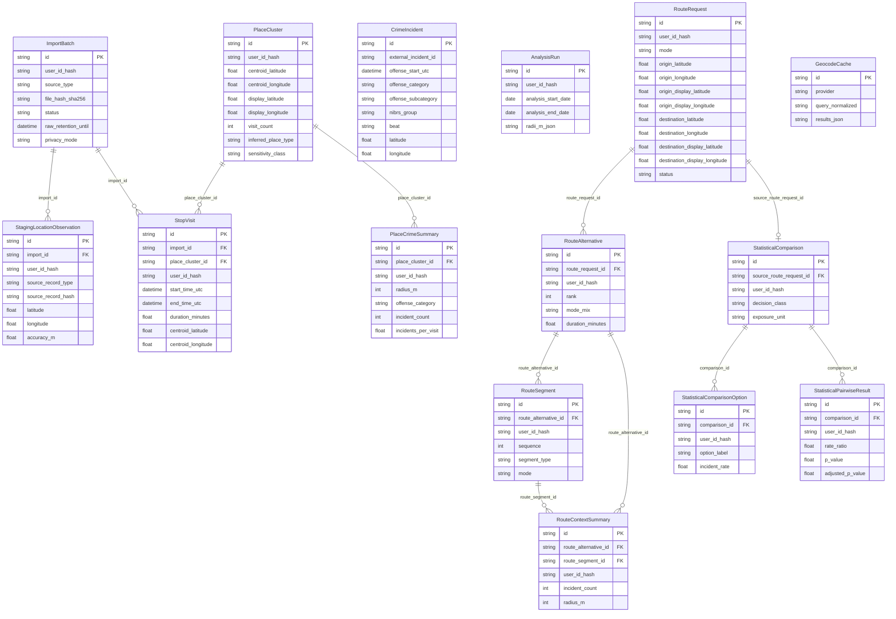

SQLAlchemy/Alembic schema for Waypoint's FastAPI backend: 15 mapped tables spanning the upload-to-cluster pipeline, SPD incident data, routing, statistical comparison, and infrastructure.

> Verified against `d30235b` (2026-06-29); arrests foundation adds source_dataset discrimination.

---

## 1. Entity catalog

All primary keys are UUID strings (`String(36)`, generated by `app/schemas.new_id`). Every
user-scoped table carries `user_id_hash` (a hashed session identity; see §2). Sources:
`app/models.py`.

### Upload → cluster pipeline

| Entity | Table | Purpose | Key columns |
|---|---|---|---|
| `ImportBatch` | `import_batches` | Records one file upload: provenance, parse state, retention policy. | `source_type`, `file_hash_sha256`, `parser_version`, `status` (`"parsed"` → `"normalized"`), `raw_retention_until`, `privacy_mode` |
| `StagingLocationObservation` | `staging_location_observations` | Raw location records parsed from the upload before normalization. Unique on `(import_id, source_record_hash)`. Deleted post-clustering unless `MCA_RAW_UPLOAD_RETENTION=true`. | `import_id` → `import_batches`, `source_record_type`, `source_record_hash`, `observed_at_utc`, `latitude`, `longitude`, `accuracy_m`, `activity_type`, `confidence_score`, `display_label` |
| `StopVisit` | `stop_visits` | Inferred dwell periods derived from raw observations (or from structured stop records). Deleted post-clustering unless `MCA_RAW_UPLOAD_RETENTION=true`. | `import_id` → `import_batches`, `place_cluster_id` → `place_clusters` (nullable, set during clustering), `start_time_utc`, `end_time_utc`, `duration_minutes`, `centroid_latitude`, `centroid_longitude`, `radius_m`, `source_basis`, `point_count_used` |
| `PlaceCluster` | `place_clusters` | A recurring place inferred by grouping nearby stop visits. The durable user-visible entity. | `centroid_latitude/longitude` (exact centroid), `display_latitude/display_longitude` (privacy-generalized, see §4), `cluster_radius_m`, `visit_count`, `total_dwell_minutes`, `inferred_place_type`, `sensitivity_class`, `cluster_version`, `cluster_method` |

### Crime

| Entity | Table | Purpose | Key columns |
|---|---|---|---|
| `CrimeIncident` | `crime_incidents` | Imported SPD incident (reported crime or arrest). Not user-scoped — shared across all sessions. Uniqueness is composite `(source_dataset, external_incident_id)`; `source_dataset` (indexed) is `seattle_spd_crime` (reported incidents) or `seattle_spd_arrests`. For arrest rows, `offense_subcategory` carries the NIBRS offense description (source-specific) and `offense_category`/`nibrs_group` are null. | `source_dataset` (indexed), `external_incident_id`, `offense_start_utc`, `offense_category`, `offense_subcategory`, `nibrs_group`, `precinct`, `sector`, `beat`, `mcpp`, `latitude`, `longitude` |
| `PlaceCrimeSummary` | `place_crime_summaries` | Pre-aggregated incident counts for a `PlaceCluster` at a given radius and date window. Invalidated and regenerated whenever normalization reruns. | `place_cluster_id` → `place_clusters`, `radius_m`, `analysis_start_date`, `analysis_end_date`, `offense_category`, `incident_count`, `nearest_incident_m`, `incidents_per_visit`, `incidents_per_hour_dwell`, `analysis_run_id` |

### Analysis

| Entity | Table | Purpose | Key columns |
|---|---|---|---|
| `AnalysisRun` | `analysis_runs` | Records the parameters of one dashboard analysis invocation. | `analysis_start_date`, `analysis_end_date`, `radii_m_json`, `offense_category`, `offense_subcategory`, `nibrs_group` |

### Routing

| Entity | Table | Purpose | Key columns |
|---|---|---|---|
| `RouteRequest` | `route_requests` | A user's origin→destination routing query. | `origin_label`, `origin_latitude/longitude`, `origin_display_latitude/display_longitude`, `destination_label`, `destination_latitude/longitude`, `destination_display_latitude/display_longitude`, `mode`, `departure_date`, `privacy_level`, `provider`, `status` |
| `RouteAlternative` | `route_alternatives` | One route option returned by the routing provider for a `RouteRequest`. | `route_request_id` → `route_requests`, `route_label`, `rank`, `duration_minutes`, `distance_m`, `transfer_count`, `mode_mix`, `summary_geometry`, `provider` |
| `RouteSegment` | `route_segments` | An individual leg of a `RouteAlternative` (walk, transit, etc.). | `route_alternative_id` → `route_alternatives`, `sequence`, `segment_type`, `mode`, `start_label`, `start_latitude/longitude`, `end_label`, `end_latitude/longitude`, `distance_m`, `duration_minutes`, `geometry` |
| `RouteContextSummary` | `route_context_summaries` | Aggregated incident context for one alternative (or segment) at a given radius. | `route_alternative_id` → `route_alternatives`, `route_segment_id` → `route_segments` (nullable), `context_label`, `context_type`, `radius_m`, `incident_count`, `nearest_incident_m`, `incidents_per_route` |

### Statistics

| Entity | Table | Purpose | Key columns |
|---|---|---|---|
| `StatisticalComparison` | `statistical_comparisons` | The result of a multi-option incident-rate comparison (e.g. route A vs route B). | `source_route_request_id` → `route_requests`, `comparison_type`, `geometry_type`, `radius_m`, `analysis_start_date`, `analysis_end_date`, `exposure_unit`, `decision_class`, `overview_summary_text`, `overview_caveat_text` |
| `StatisticalComparisonOption` | `statistical_comparison_options` | One option (arm) within a `StatisticalComparison`. | `comparison_id` → `statistical_comparisons`, `option_id`, `option_label`, `incident_count`, `exposure`, `incident_rate` |
| `StatisticalPairwiseResult` | `statistical_pairwise_results` | A single pairwise statistical test result between two options. | `comparison_id` → `statistical_comparisons`, `option_a_id`, `option_b_id`, `decision_class`, `method`, `rate_a`, `rate_b`, `rate_ratio`, `ci_lower`, `ci_upper`, `p_value`, `adjusted_p_value`, `overdispersion_phi`, `overdispersion_status` |

### Infrastructure

| Entity | Table | Purpose | Key columns |
|---|---|---|---|
| `GeocodeCache` | `geocode_cache` | Deduplicates geocoder calls. Unique on `(provider, query_normalized)`. | `provider`, `query_normalized`, `results_json` |

Total: **15 tables** matching all 15 `__tablename__` declarations in `app/models.py`.

---

## 2. User identity is not a table

There is no `User` or `Session` model. User identity is handled entirely in
`app/sessions.py`:

- A **session cookie** (`mca_session`) holds a HMAC-signed token containing a UUID session
  ID and expiry timestamp. The token is verified without a database lookup.
- The `public_user_hash` function derives a stable per-session identifier:
  `sha256(f"{MCA_USER_HASH_SALT}:public-session:{session_id}")`. This hash appears as
  `user_id_hash` on every user-scoped row. The raw session ID and the mapping from hash
  back to identity are never stored.
- **Public endpoints** require a valid session (enforced via `required_public_user_hash`
  dependency). **Internal endpoints** allow the demo-identity fallback (`current_user_hash`).
- `MCA_USER_HASH_SALT` must be overridden from its default in production; the
  `Settings.require_production_secret_overrides` validator enforces this at startup.

---

## 3. Lifecycle

```
Upload (POST /uploads)
  │
  ├─ parse_upload()                  → raw records
  ├─ persist_point_import()          → ImportBatch + StagingLocationObservation rows
  └─ normalize_import()
       ├─ detect_stops_from_observations()   → StopVisit rows
       │    (sliding-window radius grouping; MCA_STOP_RADIUS_M default 75 m,
       │     minimum dwell MCA_MINIMUM_STOP_DURATION_MINUTES default 10 min)
       └─ cluster_stop_visits()             → PlaceCluster rows
            (radius grouping; MCA_CLUSTER_RADIUS_M default 100 m,
             MCA_MINIMUM_CLUSTER_VISITS default 3,
             MCA_MINIMUM_CLUSTER_TOTAL_DWELL_MINUTES default 60)
```

After `normalize_import` completes, `run_personal_upload` in
`app/services/public_upload_service.py` immediately executes:

```python
if not settings.raw_upload_retention:
    session.execute(delete(StagingLocationObservation).where(...import_id...))
    session.execute(delete(StopVisit).where(...import_id...))
    session.commit()
```

⚠ **Invariant:** `StagingLocationObservation` rows (exact GPS points) and `StopVisit`
rows (intermediate dwell periods) are **deleted immediately after clustering** unless
`MCA_RAW_UPLOAD_RETENTION=true`. The default is `false`. Only `PlaceCluster` rows —
which carry generalized coordinates (see §4) — survive into the user-visible data layer.

Re-normalizing an import (`_delete_existing_normalization`) first wipes `StopVisit`,
`PlaceCluster`, and `PlaceCrimeSummary` rows for that import, then rebuilds them. The
`StagingLocationObservation` rows are preserved during re-normalization (they are the
source for the second pass) and are only discarded at the public-upload completion point.

---

## 4. Generalized vs exact coordinates

`PlaceCluster` stores two coordinate pairs:

| Field | Precision | Use |
|---|---|---|
| `centroid_latitude`, `centroid_longitude` | Full float (exact centroid of member stops) | Internal computation only (analysis radius queries, re-clustering) |
| `display_latitude`, `display_longitude` | Rounded to 3 decimal places (~111 m grid) | Returned to the frontend and exported |

The snapping is performed by `app/normalization/geo.snap_to_grid(lat, lon)` (its `decimals` argument defaults to `3`),
called inside `_build_cluster` in `app/normalization/clusters.py`. This produces a
display position that cannot be reverse-engineered to a precise home or workplace address.

`RouteRequest` mirrors this pattern: `origin_latitude/longitude` and
`destination_latitude/longitude` store exact router inputs, while
`origin_display_latitude/longitude` and `destination_display_latitude/longitude` are
the generalized equivalents surfaced to callers.

⚠ **Invariant:** Only generalized coordinates (`display_*`) should be returned in API
responses visible to the user. Exact centroids are internal.

---

## 5. Migrations

Alembic manages the Postgres production schema; 7 migration scripts live in
`alembic/versions/`:

| File | Content |
|---|---|
| `0001_initial_schema.py` | Creates `import_batches`, `place_clusters`, `crime_incidents`, `staging_location_observations`, `stop_visits`, `place_crime_summaries` |
| `0002_route_alternatives.py` | Adds `route_requests`, `route_alternatives`, `route_segments`, `route_context_summaries` |
| `0003_statistical_comparisons.py` | Adds `statistical_comparisons`, `statistical_comparison_options`, `statistical_pairwise_results` |
| `0004_option_geom_metadata.py` | Adds `geometry_metadata_json` to `statistical_comparison_options` |
| `0005_crime_filter_idx.py` | Adds indexes on `crime_incidents` for offense filter columns |
| `0006_analysis_runs.py` | Adds `analysis_runs` table |
| `0007_geocode_cache.py` | Adds `geocode_cache` table |
| `0008_crime_source_unique.py` | Replaces the single-column unique on `crime_incidents.external_incident_id` with a composite unique `(source_dataset, external_incident_id)` + indexes `source_dataset`; dialect-branched for SQLite/Postgres |

**Dual bootstrap path** (`app/db.init_db`):

- **SQLite (dev/test):** `Base.metadata.create_all()` is called at startup, bypassing
  Alembic. Fast for local iteration; schema reflects the current ORM models directly.
- **Postgres (production):** `create_all` is skipped. The Docker `CMD` (or `make migrate`)
  runs `alembic upgrade head`. If a Postgres instance was previously bootstrapped via the
  old `create_all` path, run `alembic stamp head` once to register the baseline revision.

**Adding a migration:**

```bash
# 1. Edit app/models.py
# 2. Generate the script
alembic revision --autogenerate -m "your_description"
# 3. Review alembic/versions/<rev>_your_description.py — autogenerate is not perfect
# 4. Apply
make migrate   # → alembic upgrade head
```

SQLite foreign keys are off by default; `app/db.configure_database` registers a
`"connect"` event listener that executes `PRAGMA foreign_keys=ON` for every SQLite
connection.

---

## 6. Entity-relationship diagram


