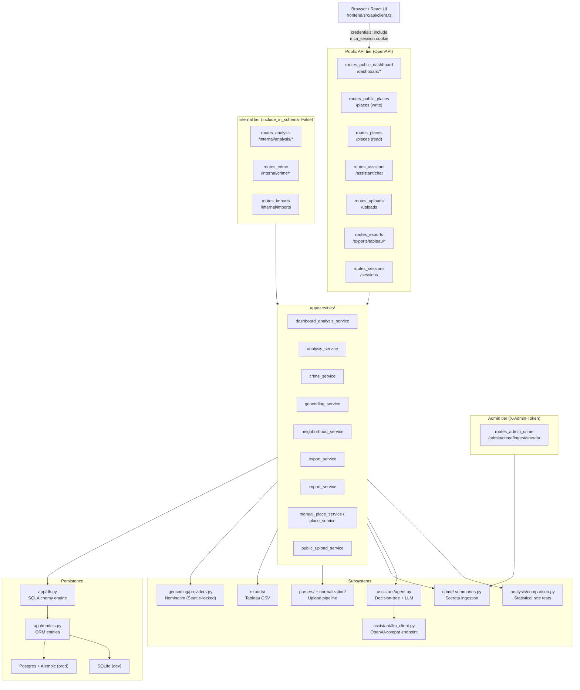

This document describes Waypoint's system architecture for maintainers and AI coding agents working the repo.

> Verified against `d30235b` (2026-06-29).

---

## 1. Purpose & product invariant

Waypoint is a privacy-first web application for exploring **reported Seattle SPD incident context** around saved places. Users look up an address (or add places manually or via a file upload), select a date range and offense filter, and then view incident counts and exposure-adjusted rates for those places — organized into Places, Analyze, Compare, and Export tabs.

⚠ **Invariant:** Waypoint surfaces *reported incident context only*. It must not produce safety scores, rank places as safe or unsafe, or claim a user was present at any incident. This boundary is enforced in two places: (1) copy and labels throughout the UI must use neutral, count/rate language; and (2) `app/assistant/agent.py` contains a regex guard (`_SAFETY_SCORE_PATTERN`) that intercepts any chat message matching safety-scoring language and returns a hard refusal before the LLM is ever called. Both enforcement points must be preserved in future changes.

---

## 2. Layered model

```
app/api/          HTTP layer — FastAPI routers, request validation, dependency injection
app/services/     Business logic — queries, orchestration, transformations, no HTTP
app/models.py     SQLAlchemy ORM entity definitions (all tables in one file)
app/db.py         Engine + session factory; create_all for SQLite, Alembic for Postgres
```

**Supporting modules** that cut across all layers:

| Module | Role |
|---|---|
| `app/schemas.py` | Shared Pydantic data-transfer objects and the `new_id()` UUID factory |
| `app/sessions.py` | HMAC-signed session token creation and validation; derives `user_id_hash` from `SESSION_COOKIE_NAME` cookie |
| `app/config.py` | `Settings` (pydantic-settings, `MCA_`-prefixed env vars) — one call to `get_settings()` per request |
| `app/input_modes.py` | Pure-Python descriptor for the four supported entry modes (`manual_places`, `bulk_places`, `public_commute_scenario`, `personal_timeline`) |

**Database strategy:** `app/db.py` `init_db()` runs `Base.metadata.create_all` only when the backend is SQLite (dev/test). Postgres schema is owned by Alembic (`make migrate` = `alembic upgrade head`). Mixing both paths on Postgres would leave `alembic_version` unstamped and mask migration drift.

**Entity set** (`app/models.py`):

- `ImportBatch`, `StagingLocationObservation`, `StopVisit` — personal-data upload pipeline
- `PlaceCluster` — the canonical saved-place record; carries display coordinates, visit statistics, sensitivity class
- `CrimeIncident` — SPD reported-incident rows ingested from Seattle Socrata
- `PlaceCrimeSummary`, `AnalysisRun` — per-place crime tallies and the run metadata that groups them
- `StatisticalComparison`, `StatisticalComparisonOption`, `StatisticalPairwiseResult` — Compare-tab statistical results
- `GeocodeCache` — TTL-bounded cache keyed by `(provider, query_normalized)`

---

## 3. API tiers

See `./api.md` for full endpoint-by-endpoint detail. Summary:

**Public** — in OpenAPI schema; require a real session token validated by `required_public_user_hash` (`app/api/deps.py`). Endpoints: `/sessions`, `/places*`, `/dashboard/*`, `/assistant/chat`, `/exports/tableau/*`, and `/uploads` (additionally gated by `MCA_PUBLIC_ENABLE_PERSONAL_UPLOADS`; responds 404 when the flag is off).

**Internal** — `include_in_schema=False`; use the permissive `current_user_hash` dependency that accepts the demo-identity fallback header `X-Demo-User-Id`. Prefixed `/internal/...`. Covers `/internal/analysis/*`, `/internal/imports`, `/internal/crime/*`, `/internal/places`, `/internal/exports/*`.

⚠ **Invariant:** Internal routers must not be re-exposed on bare public paths. `tests/test_internal_surface.py` enforces this by scanning all registered routes for internal-only prefixes appearing without `include_in_schema=False`.

**Admin** — `/admin/crime/ingest/socrata` (`app/api/routes_admin_crime.py`); guarded by the `X-Admin-Token` header checked against `MCA_ADMIN_INGEST_TOKEN`.

---

## 4. Subsystem map

| Subsystem | Entry point | Role |
|---|---|---|
| Assistant | `app/assistant/agent.py` | Decision-tree chat: classify request → call one tool or return a final answer; safety-score guard lives here |
| LLM client | `app/assistant/llm_client.py` | `OpenAiLlmClient` POSTs to `MCA_LLM_BASE_URL`; `FailoverLlmClient` wraps two clients for automatic failover |
| Statistical analysis | `app/analysis/comparison.py` | Exposure-adjusted rate tests (Poisson / quasi-Poisson), Benjamini-Hochberg correction, `DecisionClass` output |
| Crime ingestion | `app/crime/` | `seattle_socrata.py` fetches from Socrata; `summaries.py` aggregates `CrimeIncident` rows into `PlaceCrimeSummaryData` |
| Upload pipeline | `app/parsers/` + `app/normalization/` | Parsers (`google_timeline`, `gpx_points`, `csv_points`, `geojson_points`, `recurring_places`, `commute_scenario`) normalize raw uploads into `StagingLocationObservation` rows |
| Exports | `app/exports/` | `tableau.py` produces Tableau-ready CSV from stored `PlaceCrimeSummary` data |
| Geocoding | `app/geocoding/providers.py` | `NominatimProvider` calls Nominatim; region-locked to the Seattle-metro viewbox (`MCA_GEOCODER_VIEWBOX`, bounded by default) |
| Places | `app/places/schemas.py` + `app/services/manual_place_service.py` | Manual and bulk place creation/update/delete; `PlaceCluster` is the canonical record |
| Services | `app/services/` | All business logic: `dashboard_analysis_service.py`, `analysis_service.py`, `crime_service.py`, `geocoding_service.py`, `export_service.py`, `import_service.py`, `normalization_service.py`, and others |

---

## 5. Request walkthrough — `POST /dashboard/analyze`

This is the primary analysis endpoint that runs incident counts for a user's selected places.

1. **Router** (`app/api/routes_public_dashboard.py`, `analyze_dashboard_places`): FastAPI receives the request, validates the `DashboardAnalyzeRequest` body (from `app/api/dashboard_schemas.py`), and resolves two dependencies — `required_public_user_hash` (validates the `mca_session` cookie via `app/sessions.py` and derives a hashed user identity) and `get_session` (yields a SQLAlchemy `Session` from `app/db.py`).

2. **Service** (`app/services/dashboard_analysis_service.py`, `analyze_selected_places`): receives the session, `user_id_hash`, `place_ids`, `radii_m`, date range, and optional offense filters.

   a. Validates the date range (end ≥ start).

   b. Queries `PlaceCluster` rows for the given `place_ids` scoped to `user_id_hash` — raises 400 if any are missing.

   c. Runs a bounding-box query against `CrimeIncident` for all clusters simultaneously, filtered by date range and optional offense category/subcategory/NIBRS group.

   d. Calls `app/crime/summaries.py` `summarize_place_crime` to compute per-cluster, per-radius incident counts and `PlaceCrimeSummaryData` objects.

   e. Creates an `AnalysisRun` record via `app/services/analysis_runs.py` `create_analysis_run`, stamps each `PlaceCrimeSummary` model with the run ID, and bulk-inserts them.

   f. Commits the session and returns `{"summary_count": N}`.

3. **Response**: the router passes the dict directly to FastAPI; the declared return type `dict[str, int]` drives JSON serialization.

Modules touched in order: `routes_public_dashboard` → `deps` (session cookie) → `sessions` (token verification) → `config` (salt) → `db` (session) → `dashboard_analysis_service` → `analysis_runs` → `crime/summaries` → `models` (`PlaceCluster`, `CrimeIncident`, `PlaceCrimeSummary`, `AnalysisRun`) → `schemas` (`PlaceClusterData`, `CrimeIncidentData`).

---

## 6. Backend ↔ frontend

`frontend/src/api/client.ts` is the sole HTTP client for the React app. It calls only the **public** tier: `/sessions`, `/places`, `/places/bulk`, `/uploads`, `/dashboard/analyze`, `/dashboard/incidents`, `/dashboard/compare`, `/dashboard/neighborhood`, `/dashboard/geocode`, `/assistant/chat`, `/exports/tableau/*`, and `/input-modes`. Requests always include `credentials: "include"` so the `mca_session` cookie is attached.

The assistant endpoint (`/assistant/chat`) is consumed as a Server-Sent Events stream: `streamAssistantChat` in `client.ts` reads `event:`/`data:` frames and dispatches them to caller-supplied handlers.

**Serving modes:**

- **Built mode** (production / `make run`): `app/main.py` `mount_dashboard()` serves `app/static/dashboard/index.html` at `/` and `app/static/dashboard/assets/` at `/assets/` using FastAPI's `StaticFiles`. The `MCA_STATIC_DASHBOARD_DIR` setting controls the path; mounting is silently skipped if `index.html` does not exist.
- **Vite dev mode**: `npm run dev` in `frontend/` starts Vite on its own port; the browser talks to the FastAPI backend (typically `:8000`) directly, with the session cookie shared by same-origin or proxy configuration.

---

## 7. Invariants index

- **Reported-context-only (no safety scoring):** enforced in `app/assistant/agent.py` (`_SAFETY_SCORE_PATTERN` guard) and in all UI copy. See `./assistant.md` for agent-level detail.
- **Internal routers not re-exposed publicly:** enforced by `tests/test_internal_surface.py`. See `./api.md` for the full tier map.
- **No `create_all` on Postgres:** `app/db.py` `init_db()` skips `create_all` when the backend is not SQLite; schema is owned exclusively by Alembic. See `./data-model.md` for migration guidance.
- **Public session required for public endpoints:** `required_public_user_hash` raises HTTP 401 when no valid `mca_session` cookie is present; internal endpoints use the more permissive `current_user_hash`. See `./api.md`.
- **Geocoder region-locked to Seattle metro:** `NominatimProvider` applies `MCA_GEOCODER_VIEWBOX` and `MCA_GEOCODER_BOUNDED` so ambiguous place names resolve in Seattle, not elsewhere. See `app/config.py` and `app/geocoding/providers.py`.
- **Personal uploads off by default:** `MCA_PUBLIC_ENABLE_PERSONAL_UPLOADS=false` causes `/uploads` to 404; the feature must be explicitly enabled. See `./api.md`.

---

## 8. Layer and subsystem map


