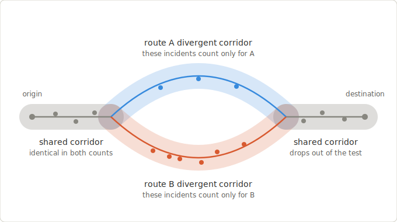

# Route comparison on divergent corridors

**Date:** 2026-07-03
**Branch / worktree:** `jcscocca/claude/route-divergent-comparison` (`.worktrees/route-divergent-comparison`)
**Status:** Design — awaiting user review before implementation plan.

## Goal

Make the Routes verdict capable of saying something. Today the route comparison tests
whole corridors against each other, and route alternatives between the same origin and
destination share most of their corridor — so the shared incidents land in both counts,
drag the rate ratio toward 1.0, and the conservative thresholds (rate ratio ≤ 0.80,
BH-adjusted p < 0.05, against every alternative) can essentially never fire. "There is no
statistically clear lower-incident alternative" is the structurally guaranteed steady
state, not a data problem.

This change re-scopes the route statistical test to the **divergent corridors** — the
parts of each route that are *not* within the analysis radius of the other route. Shared
incidents drop out; each side's exposure shrinks to its divergent corridor; everything
downstream (rate test, overdispersion, BH, floors) is unchanged.



Two reasons this is correct and not just a sensitivity knob:

1. **Statistical validity.** The Wald / exact-conditional machinery models the two counts
   as independent Poisson draws. When the same physical incidents appear in both counts,
   that assumption is badly violated. Disjoint regions mean no incident is counted twice.
2. **Decision relevance.** The shared corridor is traversed either way; it carries no
   information for the choice. The divergent rate is the quantity the decision depends on.

## Decision record

- 2026-07-03, user decision: **retire the whole-corridor hypothesis test for routes.**
  The divergent-corridor test becomes *the* route verdict. Whole-corridor counts remain in
  the payload as descriptive context (the per-option rows), and are never tested. No
  second p-value anywhere.
- Site (place-buffer) comparisons are untouched by this change.

## Product invariant (must not break)

Waypoint reports *reported incident context*. Routes MUST NOT score safety or rank routes
as safe/dangerous. All new copy is scoped to reported incidents on the divergent segments
("Where these routes differ, …") and keeps the existing caveat that this describes
reported incidents, not causation or personal outcomes.

## Current state (verified)

- `compare_route_request` counts each alternative's incidents over its **full** corridor
  ([app/services/analysis_service.py:171-197](app/services/analysis_service.py)); corridor
  membership is `point_to_route_distance_m(incident, polyline) <= radius_m`
  ([app/analysis/exposure.py:110-139](app/analysis/exposure.py)); exposure is the whole
  corridor's analytic area × days ([exposure.py:51-62](app/analysis/exposure.py)).
- A recommendation requires BH-adjusted p < `ALPHA` and rate ratio ≤
  `MAX_RATE_RATIO_FOR_RECOMMENDATION` against **every** alternative
  ([app/analysis/rate_tests.py:8-15](app/analysis/rate_tests.py),
  [app/analysis/comparison.py:246-256](app/analysis/comparison.py)). With ~80% corridor
  overlap, even a 2× incident-rate difference on the divergent stretch yields a
  whole-corridor ratio ≈ 0.83 → fails the floor.
- Pairwise persistence already stores per-pair counts and exposures
  (`StatisticalPairwiseResult.incident_count_a/b`, `exposure_a/b`,
  [app/models.py:351](app/models.py)); `minimum_data_status`, `geometry_type`, and the
  summary/caveat texts are plain text columns → **no migration needed**.
- Overview strings are built in `_overview_summary`
  ([comparison.py:259-269](app/analysis/comparison.py)) and shared by the site and route
  paths; route copy must branch without altering site strings (dashboard tests pin them).
- The frontend renders backend `summary_text` / `caveat_text` verbatim
  ([frontend/src/components/RoutesTab.tsx:256-295](frontend/src/components/RoutesTab.tsx));
  no frontend code enumerates `geometry_type` or decision-class-specific copy (verified by
  grep) → frontend changes are nil-to-cosmetic.
- The auto-comparison uses `radii_m[0]` and swallows `ValueError`
  ([app/services/route_service.py:257-284](app/services/route_service.py)) — behavior
  retained as-is.

## Scope

**In scope**
- New divergence geometry module (`app/analysis/divergence.py`).
- Pairwise route comparison builder with route-specific copy (`app/analysis/comparison.py`,
  `app/analysis/schemas.py`).
- Service wiring (`app/services/analysis_service.py::compare_route_request`).
- Methodology doc rewrite + committed figure; ROADMAP tick.
- Tests (TDD) for all of the above.

**Out of scope (follow-ups)**
- OTP itinerary geometry dedup (the identical-corridor outcome defuses most of it).
- The per-route stop-buffer display counts mislabeled as "Corridor (≤250 m)"
  ([RoutesTab.tsx:33-42](frontend/src/components/RoutesTab.tsx) over endpoint-buffer
  summaries from [app/routing/context.py:84-106](app/routing/context.py)) — separate fix.
- Overlapping place-buffer *site* comparisons share the same double-count flaw —
  documented as a known limitation in the methodology doc, not fixed here.
- Surfacing the swallowed `ValueError` distinctly from insufficient data.
- Using `departure_time` to time-slice the incident window (larger follow-up).

---

## Component A — divergence geometry (`app/analysis/divergence.py`)

Constants:

```python
SAMPLE_STEP_M = 25.0                 # densification spacing along a polyline
IDENTICAL_DIVERGENT_SHARE = 0.02     # both sides below this → corridors effectively identical
```

Functions (pure, no DB):

- `densify_polyline(points, step_m=SAMPLE_STEP_M) -> list[tuple[float, float]]` — linear
  lat/lon interpolation so consecutive samples are ≤ `step_m` apart (haversine spacing;
  fine at Seattle scale). Needed because the mock provider emits 2-point straight lines;
  OTP polylines are already dense but are densified uniformly anyway.
- `divergent_length_km(self_points, other_points, radius_m) -> float` — densify
  `self_points`; a span between consecutive samples is divergent when **both** endpoints
  are > `radius_m` from `other_points` (via existing
  `point_to_route_distance_m`). Returns the summed divergent length. Divergent share =
  `divergent_length_km / route_length_km` (existing `route_length_km`).
- `divergent_exposure_square_km_days(divergent_length_km, radius_m, start, end) -> float`
  — `divergent_length_km × 2·radius_km × analysis_days`. No π·r² end-cap term: divergent
  runs border the shared region, so end-caps are largely inside it. Documented
  approximation, same spirit as the existing analytic corridor formula.
- Disjoint incident partition happens in the service (Component C) by set algebra over
  per-option memberships — no new distance code needed for counting.

**Performance note.** Divergent-length sampling is O(pairs × samples × other-polyline
points) of pure-Python haversine — for 3 alternatives ≈ low hundreds of ms worst case,
on a request that already does full-corridor counting per option. Acceptable at current
scale (Python-side distance math is this repo's intentional baseline). `SAMPLE_STEP_M`
is the tuning latitude if it ever isn't.

## Component B — pairwise comparison builder (`app/analysis/comparison.py`, `schemas.py`)

- `GeometryType.ROUTE_DIVERGENT_CORRIDOR = "route_divergent_corridor"` (stored as text).
- New input schema `PairDivergenceInput`: `option_a_id`, `option_b_id`, per-side divergent
  `count`, `exposure`, monthly `period_counts` (of the divergent incidents), and
  `divergent_share`.
- New builder `build_route_divergent_comparison(...)` taking the whole-corridor
  `AnalysisOptionResult` rows (kept as descriptive context in the payload) plus
  `pair_inputs`. It shares the existing helpers (`compare_incident_rates`,
  `_combined_dispersion`, `benjamini_hochberg`, `classify_pairwise_result`,
  `_overall_decision`, `_not_tested_pairwise` pattern). `build_statistical_comparison`
  remains as-is for the site path.
- **Candidate selection:** the option with the lowest *aggregate divergent rate* —
  Σ(its per-pair divergent counts) / Σ(its per-pair divergent exposures) — among options
  with positive aggregate divergent exposure; ties break by option rank. If no option has
  positive aggregate divergent exposure (all corridors effectively identical), fall back
  to the lowest whole-corridor rate purely to structure the pairwise rows — every pair is
  then not-tested and the overview reports the same-corridor outcome. The
  selective-inference posture is unchanged
  (selection uncorrected; recommendation requires dominating every pair by the material
  margin), and the existing methodology-doc argument carries over.
- **Per-pair `minimum_data_status`** (first match wins):
  1. `date_range_too_short` (< `MIN_ANALYSIS_DAYS`)
  2. `corridors_effectively_identical` — both sides' divergent share <
     `IDENTICAL_DIVERGENT_SHARE`; pair not tested (p = 1.0 row, like the existing
     not-tested pattern)
  3. `non_positive_exposure` — either side's divergent exposure ≤ 0 (covers full
     containment: a route lying entirely within the other's radius)
  4. `option_count_too_low` — candidate's divergent count < `MIN_PLACE_COUNT`
  5. `combined_count_too_low` — pair's divergent counts sum < `MIN_COMBINED_COUNT`
  6. `met`
- **Route overview strings** (site strings byte-identical; builder branches on
  comparison type):
  - recommended: `"Where these routes differ, {label} has a statistically lower
    reported-incident rate for the selected date range and offense filter."`
  - all pairs `corridors_effectively_identical`: `"These route options follow essentially
    the same corridor at this radius, so there is no divergent segment to compare."`
  - default: `"Where these routes differ, no option has a statistically clear lower
    reported-incident rate under the selected filters."`
  - `insufficient_data` / `model_warning`: reuse existing strings.
  - Overview caveats unchanged.
- **Pairwise caveat** gains a shared-share note, e.g. `"These routes share ~84% of their
  corridors; only the divergent segments were compared."` (text column; no schema change).

## Component C — service wiring (`app/services/analysis_service.py::compare_route_request`)

Unchanged: bbox incident fetch, whole-corridor per-option counts/exposures for the
context rows, geometry metadata, persistence via `_persist_and_payload`.

New, before building the comparison:

1. Parse + densify each alternative's polyline once; compute per-option corridor
   membership once (the existing `count_incidents_in_route_corridor` result, identity-keyed
   set). Pair partition is then set algebra: `a_only = in_a − in_b`, `b_only = in_b − in_a`
   — no per-pair distance recomputation for counting.
2. For each unordered pair: divergent lengths/shares both sides (Component A), divergent
   exposures, `_monthly_counts` over each side's disjoint incident list →
   `PairDivergenceInput`.
3. Call `build_route_divergent_comparison`. Comparison rows persist exactly as today —
   pairwise columns now carry divergent counts/exposures/rates; option rows carry
   whole-corridor context; `geometry_type = "route_divergent_corridor"`.

`route_service._create_route_statistical_comparison_if_possible` and the public API
surface are unchanged (payload shape identical; only semantics + strings differ).
`compare_site_options` is untouched.

## Component D — docs + figure

- Figure committed at [docs/analysis/img/route-divergence-corridors.svg](../../analysis/img/route-divergence-corridors.svg)
  (self-contained fonts/colors; renders on GitHub in both themes). Embedded in the
  methodology doc and referenced from this spec.
- [docs/analysis/statistical-route-place-comparison.md](../../analysis/statistical-route-place-comparison.md):
  - New section **"Route comparisons test divergent corridors"** with the figure: the
    three-region partition, the disjoint counting rule, divergent exposure, the
    effectively-identical outcome, and the two-part rationale (independence + decision
    relevance).
  - Exposure section: route *test* exposure is the divergent-corridor formula;
    whole-corridor exposure remains for the descriptive context rows.
  - Recommendation-threshold section: route floors apply to divergent counts.
  - Known-limitation note: overlapping place buffers in site comparisons still
    double-count shared incidents (follow-up).
- [docs/architecture/api.md](../../architecture/api.md): update the route-comparison
  payload description if it narrates whole-corridor semantics (verify during
  implementation).
- [docs/ROADMAP.md](../../ROADMAP.md): fold a tick per house cadence.

## Component E — tests (TDD order)

1. `tests/test_analysis_divergence.py` (new): densify spacing/degenerate inputs;
   `divergent_length_km` on synthetic geometries — identical polylines → 0, fully
   disjoint → total length, partial overlap, multi-run divergence (diverge/rejoin/diverge);
   exposure arithmetic; share computation.
2. `tests/test_statistical_comparison_service.py` (extend):
   - shared-corridor dilution gone: two routes share a heavy-incident stretch, one's
     divergent stretch is ~3× worse → `statistically_lower` fires and the persisted
     pairwise counts equal the divergent-only counts (the old whole-corridor framing would
     have returned `not_statistically_clear`);
   - time-shifted-duplicate geometries → `corridors_effectively_identical` + the
     same-corridor overview string;
   - floors on divergent counts (candidate divergent count < 3 → no recommendation);
   - three options: candidate must clear every pair;
   - `geometry_type == "route_divergent_corridor"`; option rows still carry whole-corridor
     counts.
3. `tests/test_route_alternatives_api.py`, `tests/test_routes_public_api.py`: payload
   shape unchanged; assertions on summary strings updated.
4. Frontend `RoutesTab.test.tsx`: fixtures reference old copy — update strings
   (cosmetic; no component changes expected).
5. Gate: `make test-all`.

## Verification

- `make test-all` green in the worktree before PR.
- Manual smoke against the mock provider (two-alternative fixture) confirming the new
  overview strings end-to-end; if the mock pair's geometries barely diverge, the smoke
  exercises the `corridors_effectively_identical` path instead — either outcome validates
  the wiring.
